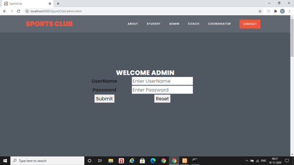
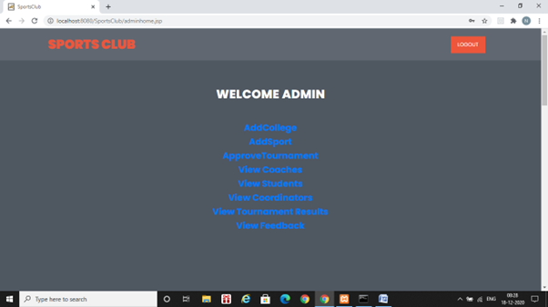

# SportsClub-application
***
_{ Sports Club is aimed to provide services, opportunities to any student player to participate with in a team. This application helps to know the information of our favourite sports. In this sports club, we are going to indicate the notifications like date, place, time., etc of various college sports tournaments. In this system, no student player is going to miss the opportunity to participate in a game. }_

## Tools/Technologies Used
* Java - Java language was designed to be small, simple and portable across platforms, operating systems, both at the source and at the binary level
* JSP - Java Server Pages are simple, yet powerful technology for creating and maintaining dynamic content web pages. 
* JavaScript - JavaScript supports the development of both client and server components of web-based applications. 
* HTML - Used for structuring the webpage

## Deployement Technologies
* Server: Apache Tomcat 
* Database: MySQL

## Description
_{ This Proposed System intimates all the information about the upcoming sports tournaments going on in the different colleges (date, time, place, registration start and end date). It categorizes its members into different categories i.e., admin, college sports coordinator, coach, and student player and present them with the respective functionality as per their level of access. The information is kept up to date by admin. College sports coordinator can also register a team from his college, for the sport events conducted in other colleges, as per the selection list provided by the coach. Students can also view the winners and runners of the match of a sport conducted in various college tournaments. This eliminates the presence of him physically and makes easier to get the information.  }_

## Setup Requirements
* Start the Tomcat server.
* Start your browser if it is not already running.
* In the address area of the browser, type http://localhost:8080/SportsClub/admin.html and submit that address to the browser.
* The output of your HTML page will be displayed

## Screenshots of admin page and adminhome page

